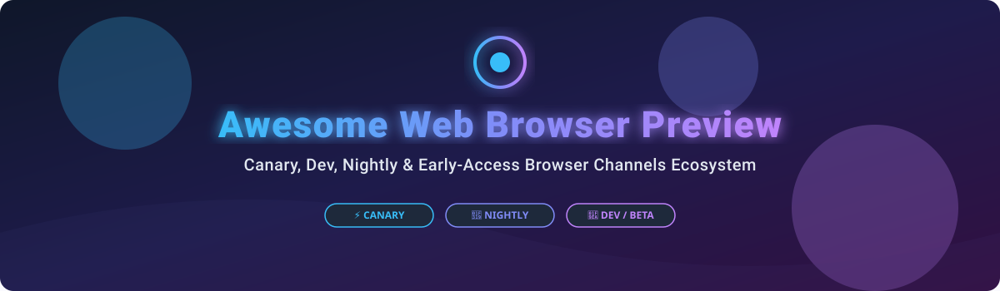

# Awesome Web Browser Preview 🌐🚀

  
  
  
  
  

## 📌 Overview & SEO Summary 🔍

Welcome to the **Awesome Web Browser Preview** ecosystem guide! 🌐 This repository is a curated catalog of **SaaS web preview platforms**, **browser automation testing environments**, and **open-source web browser engine builds**. Whether you are looking for early-access **Chromium Canary**, **Firefox Nightly**, **Safari Technology Preview**, or cloud-based cross-browser preview infrastructure (such as BrowserStack or Sauce Labs), this list covers the entire developer spectrum. ⚡

---

## 💡 Market Size & Sector Analysis 📊

> 💰 **Estimated Market Size**: The global web browser & cross-browser testing platform market is estimated at **$3.8 Billion (2026)** and is projected to reach over **$7.5 Billion by 2030** (CAGR ~14.5%).
> 
> 🧩 **Market Fragmentation**: The cloud browser preview & testing sector is **highly concentrated** at the top tier among major tech giants (Google, Microsoft, Apple) and established SaaS testing suites (BrowserStack, Sauce Labs), but **moderately fragmented** in niche privacy, developer tooling, and independent open-source browser engine projects (Servo, Ladybird).

---

## ☁️ SaaS / Hosted Platforms 🛠️

| Product / Company | Company Size / Valuation / Revenue 📈 | Starting Paid Tier Pricing 💵 | Free Tier Limit / Free Trial 🎁 | Description 📝 |
| :--- | :--- | :--- | :--- | :--- |
| **[Safari Technology Preview](https://developer.apple.com/safari/technology-preview/)** (Apple Inc.) | $3.4 Trillion Market Cap / $385B Annual Rev | $0 / Free | Unlimited free standalone access on macOS | Standalone Safari preview build powered by the latest WebKit engine features. |
| **[Microsoft Edge Preview Channels](https://www.microsoft.com/edge/download/insider)** (Microsoft Corp.) | $3.1 Trillion Market Cap / $245B Annual Rev | $0 / Free | Unlimited free access to Canary, Dev, and Beta builds | Edge Insider builds (Canary, Dev, Beta) with early enterprise and AI features. |
| **[Google Chrome Preview Channels](https://www.google.com/chrome/canary/)** (Alphabet Inc.) | $2.2 Trillion Market Cap / $307B Annual Rev | $0 / Free | Unlimited free access to Canary, Dev, and Beta channels | Bleeding-edge Chrome builds (Canary daily, Dev weekly, Beta 4-week cycle) for early testing. |
| **[BrowserStack](https://www.browserstack.com/)** | $4.0 Billion Valuation / ~$200M ARR | $29 / month (Billed annually) | 30 minutes of real browser testing free trial | Cloud platform offering real-time browser preview testing across 3000+ real browsers & OS builds. |
| **[Brave Preview Channels](https://brave.com/download-nightly/)** (Brave Software) | $1.5 Billion Valuation / ~$50M Rev | $0 / Free | Unlimited free access to Nightly, Dev, and Beta channels | Privacy-focused preview channels (Nightly daily, Dev weekly, Beta 4-weekly). |
| **[Sauce Labs](https://saucelabs.com/)** | $1.4 Billion Valuation / ~$160M ARR | $39 / month (Billed annually) | 14-day free trial with 60 minutes of live testing & 360 automated minutes | Continuous testing cloud for live manual browser preview and automated cross-browser testing. |
| **[Opera Preview Channels](https://www.opera.com/developer)** (Opera Norway) | $1.2 Billion Market Cap / $396M Annual Rev | $0 / Free | Unlimited free access to Developer and Beta channels | Early-access builds for Opera browser featuring experimental UI and developer updates. |
| **[LambdaTest](https://www.lambdatest.com/)** | $300 Million Valuation / ~$45M ARR | $15 / month (Billed annually) | Free Forever plan with 60 mins/month live testing (10 mins/session) | Next-generation cloud testing platform for live interactive cross-browser previewing. |
| **[Vivaldi Preview Channels](https://vivaldi.com/blog/snapshots/)** (Vivaldi Technologies) | ~$15 Million ARR | $0 / Free | Unlimited free access to Vivaldi Snapshot & Beta builds | Highly customizable browser snapshot preview builds updated frequently with UI experiments. |

---

## 🔓 Open-Source GitHub Projects 🐙

Open-source preview builds give developers full visibility into browser engine development, rendering pipelines, and upcoming Web APIs. (Sorted by GitHub Star Count descending)

-  **[Chromium Snapshots](https://github.com/chromium/chromium)** 🌐  
  The core foundation behind Chrome, Edge, Brave, and Vivaldi. Public snapshots updated continuously with zero proprietary services.

-  **[Ladybird](https://github.com/LadybirdBrowser/ladybird)** 🐞  
  Truly independent open-source browser and engine written from scratch in C++, backed by the Ladybird Browser Initiative.

-  **[WebKit Nightly](https://github.com/WebKit/WebKit)** 🍏  
  The engine powering Safari, iOS browsers, and WebKitGTK. Bleeding-edge engine snapshots updated daily.

-  **[Firefox Nightly (Gecko Engine)](https://github.com/mozilla/gecko-dev)** 🦊  
  Mozilla's bleeding-edge Gecko engine development repository. Updated daily for testing upcoming web standard implementations.

-  **[Servo Nightly](https://github.com/servo/servo)** ⚙️  
  Independent, modular, parallel web browser engine written in Rust under Linux Foundation Europe.

-  **[ungoogled-chromium](https://github.com/ungoogled-software/ungoogled-chromium)** 🔒  
  Lightweight modification of Chromium removing Google Web Services integration and telemetry.

-  **[Tor Browser Alpha](https://github.com/torproject/tor-browser)** 🧅  
  Privacy & anonymity focused preview builds based on Firefox ESR with latest Tor network features.

-  **[LibreWolf](https://github.com/LibreWolf)** 🐺  
  Community-maintained Firefox fork focused on privacy, security, and user freedom.

-  **[Epiphany (GNOME Web)](https://github.com/GNOME/epiphany)** 🐧  
  WebKitGTK-based browser designed for the GNOME desktop environment with nightly build channels.

-  **[Falkon](https://github.com/KDE/falkon)** 🦅  
  QtWebEngine-based cross-platform web browser developed by KDE with early-access builds.

---

## 🤝 How to Contribute 📝

1. **Fork** the repository 🍴
2. **Create** a branch for your feature/addition 🌿
3. **Add** your entry keeping descriptions concise & accurate ✍️
4. **Open** a Pull Request with details about the browser/tool 🚀

---

## ⚠️ Disclaimer & Safety Guidelines 🔒

- **Preview builds are unstable by design**: They can experience crashes or profile corruption.
- **Do not use preview builds for primary production work** or sensitive financial transactions.
- Extension APIs might occasionally break on Nightly / Canary channels.

---

## ⭐ Star History

---

## 💖 Support & Acknowledgments 🙏

Thank you for exploring the **Awesome Web Browser Preview** collection! If this project helps your developer workflow or browser testing, please consider giving it a ⭐ **Star**, **Forking** the repository, or sharing it with your fellow web developers!

☕ **Buy Me a Coffee**: If you'd like to support ongoing open-source curation and development, check out the [GitHub Sponsor Dashboard](https://github.com/sponsors/ishandutta2007).

---

**Made with ❤️ for web developers, browser engineers, and open-source enthusiasts.**
